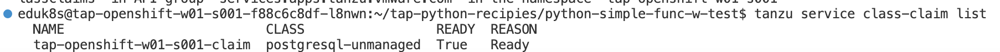

Platform Operator 編で実施したService Toolkit および Service Bindings を
App Operator 編で実施した場合の効果についてみていきます。

VScode ServerのOpen Folder より以下を開いてください。

-   /home/eduk8s/tap-python-recipies/python-rdb-sb-func/

{width="6.875in"
height="2.3472222222222223in"}

Editor のターミナルを開いて以下を確認してください。

まず以下のコマンドを実行します。

```
kubectl get secrets
```


{width="7.5in" height="0.33541666666666664in"}

ここで、重要なのが、**App Developer がSecret
にはアクセスができない**という点です。なので、Secret
の中身は開発者視点からは隠蔽されています。Secretにはアクセスできないにも関わらず、どのようにアプリケーションから利用できるかみていきます。

次に以下を実行します。

```
tanzu service class-claim list
```

{width="7.5in" height="0.3902777777777778in"}

Platform Operator編ですでに定義した Claim が確認できると思います。

Workload.yaml
を開きます。実行の前に、値を**\$YOUR_NAMESPACE-claim**にアップデートしてください。

{width="6.279481627296588in"
height="3.978665791776028in"}

Requirements.txt
を開きます。Pyservicebindingsと呼ばれるライブラリが追加されていることを確認します。

{width="2.834328521434821in"
height="0.7770352143482064in"}

左ペインより、"Tanzu Apply Workload"
を実行します。デプロイが完了するまでまちます。

\$ kubectl get ksvc
よりエンドポイントを確認後、ブラウザよりurlへアクセスを行います。\
すると以下のとおり、サービスの認証情報を取得できていることを確認します。

{width="7.055371828521435in"
height="0.5760870516185477in"}

{width="7.239874234470691in"
height="0.9061406386701663in"}

App Developer 視点での Service Bindings
のメリットとして、パスワードなどの認証情報を知らずともアプリケーションのライブラリによって、透過的に渡すことができます。このようにすることでよりセキュアな外部リソース管理が行えます。

Service Bindings 連携の確認は以上です。
