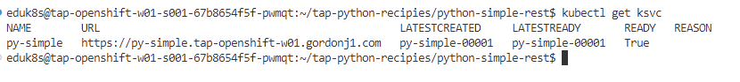

通常のLinuxサーバー上で起動するような従来型のアプリケーションをTAP経由でデプロイします。

メニューよりOpen Folder を選択します。

{width="3.7461450131233596in"
height="1.2927876202974629in"}

/home/eduk8s/tap-python-recipies/python-simple-rest/
を入力し、フォルダーを起動します。

左ペインで右クリックを行い、"Tanzu Apply Workload" を選択します。

{width="2.2541240157480313in"
height="3.574931102362205in"}

ワークロードがデプロイされるまで、2-3分待ちます。

ターミナルを起動して、エンドポイントのURLの確認および動作の確認をします。

\$ kubectl get ksvc

{width="7.783073053368329in"
height="0.87207895888014in"}

webブラウザ経由で上記の URL を入力し、サービス内容を確認します。

{width="7.354025590551181in"
height="1.0208136482939631in"}

アプリケーションの動作確認としては以上ですが、ソースコードを参照します。

以下の特徴があります。

-   Server.py にFlaskなどのWebサーバーの起動をすることが必要

-   \@app_route
    アノテーションにより、どのエンドポイントで起動するかの明示指定が必要

-   Requirements.txt にFlaskおよび Gunicorn の依存関係指定が必要

-   Procfile に最終的な起動コマンドの指定が必要

Linuxサーバー上でアプリケーションを起動する場合にはほぼ当たり前のように設定が必要な上記ですが、いわゆるビジネスロジックとは無関係なコードが多く含まれていることがわかります。これを念頭に次のハンズオンに進みます。
