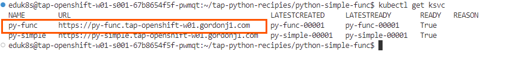
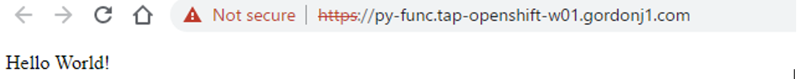

TAP ではFunction Buildpacks
を提供しており、サーバレス相当の軽量な開発スタイルを可能にしております。\
詳細については以下のブログを参照してください。

[Tanzu Application Platform でサーバレスとコンテナを和解？Vol1: Function
Buildpacks](https://blogs.vmware.com/vmware-japan/2023/01/tanzu-application-platform-function-buildpacks-to-intergrate-serverless-and-containers.html)\
\
このハンズオンでは、TAP でサポートしているFunctions
Buildpacks経由のアプリケーションのデプロイを行います。

Editor より、Open Folder を選択し、以下のフォルダーを選択します。

-   /home/eduk8s/tap-python-recipies/python-simple-func/

展開後、同じくTanzu Apply Workload
よりデプロイを展開します。デプロイが完了するまで1-2分待ったのち以下のコマンドで動作を確認します。

同様に Webブラウザから確認します。

アプリケーションのデプロイとしては、以上ですが、ソースコードを比較します。

以下の特徴があります。

-   FlaskやGunicorn といった、Webサーバーに関する記述がなく、func.py
    には main 関数がある程度
-   requirements.txt
    には依存関係が記載されていない（なお、空ファイルであろうと必ず必要です。）
-   workload.yaml に BP_FUNCTION
    にあくまで、起動する関数が記載されている程度

Functionsビルドパックは、関数のみを記載し、Webサーバーのセットアップはプラットフォームがセットアップするものとなっています。結果として、コードもビジネスロジックのみを記載したもので完結がなされます。

このハンズオンでは、HTTPイベントをトリガーに起動するアプリケーションで紹介しました。得られた結果("Hello
World")
は、同じであるも従来型のワークロードと比べサーバレスなどのコーディングモデルにより近いものが利用できることがわかります。

Functionsアプリケーションのデプロイは以上です。
