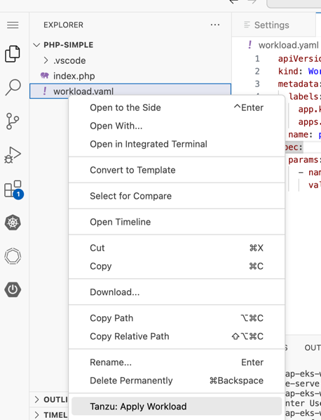
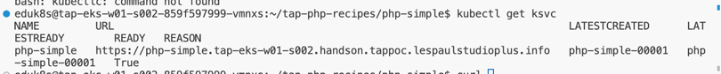
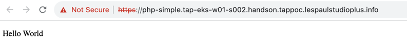

シンプルなウェブアプリケーションをTAP経由でデプロイします。
メニューよりOpen Folder を選択します。


/home/eduk8s/tap-python-recipies/php-simple
を入力し、フォルダーを起動します。

左ペインで右クリックを行い、"Tanzu Apply Workload" を選択します。

!

ワークロードがデプロイされるまで、2-3分待ちます。

ターミナルを起動して、エンドポイントのURLの確認および動作の確認をします。

```
kubectl get ksvc
```


webブラウザ経由で上記の URL を入力し、サービス内容を確認します。



アプリケーションの動作確認としては以上です。まずはシンプルなデプロイを確認しました。

次のハンズオンに進みます。
