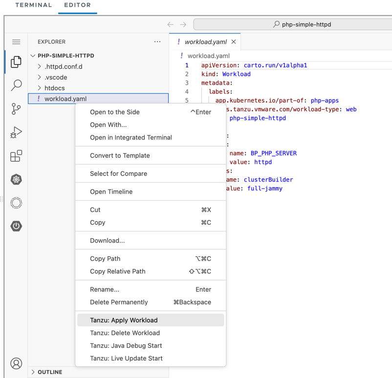
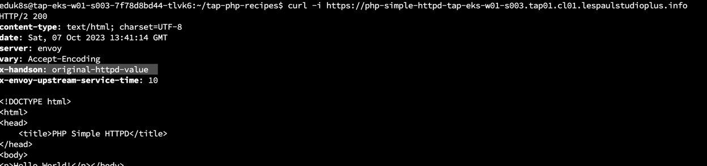

PHP のビルドバックでは、Webサーバーを Apache HTTPD もしくは、Nginx に切り替え、さらに個別のカスタマイズが可能です。
以下をご参照ください。

https://paketo.io/docs/howto/php/#select-a-web-server

この手順では、Apache HTTPD に切り替える手順をためします。

Editor より、Open Folder を選択し、以下のフォルダーを選択します。

-   /home/eduk8s/tap-python-recipies/python-simple-httpd

展開後、同じくTanzu Apply Workload
よりデプロイを展開します。デプロイが完了するまで1-2分待ったのち以下のコマンドで動作を確認します。


起動が完了したら以下のコマンドでURLを確認してブラウザでログインします。

```
kubectl get ksvc
```

表示されたURLに対して以下のコマンドを実行します。

```
curl -i $URL
```

正常に応答が返ってきた場合、ヘッダーに注目して `X-HandsOn "original-httpd-value"` が含まれていることを確認してください。



アプリケーションのデプロイとしては、以上ですが、ソースコードを比較します。

以下の特徴があります。

-   .httpd.conf.d/ 以下に追加の httpd の設定が含まれておりその設定が反映されていること

アプリケーションのデプロイは以上です。
