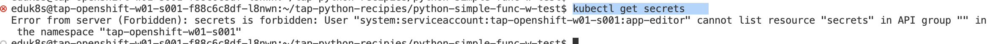

Platform Operator でも登場した Service Toolkit および Service Bindings がどのように動作するのかを見ていきます。
Service Bindings の動作については、Buildpack の仕様に大きく依存します。  

PHP ビルドパックの場合、セッション管理を行うための、memcached もしくは redis 互換のデータストアと透過的に接続する方法を持ち合わせています。
このハンズオンでは、その内容を検証します。詳細は以下のマニュアルもご参照ください。

https://docs.vmware.com/en/VMware-Tanzu-Buildpacks/services/tanzu-buildpacks/GUID-php-php-buildpack.html#enable-a-session-handler-via-service-bindings

Open Folder から以下のディレクトリーを開きます。

-   /home/eduk8s/tap-php-recipies/php-simple-rest-w-supported-bindings


Editor のターミナルを開いて以下を確認してください。
まず以下のコマンドを実行します。

```
kubectl get secrets
```




ここで、重要なのが、**App Developer がSecret
にはアクセスができない**という点です。Secretにはアクセスできないにも関わらず、どのようにアプリケーションから利用できるかみていきます。

以下のコマンドを実行して redis のデプロイが行えていることを確認します。

```
tanzu service class-claim get redis-claim
```

左ペインより、"Tanzu Apply Workload" を実行します。
デプロイ後以下のコマンドで、たちがったインスタンス数を確認します。(通常このタイミングでは、3つのインスタンスが起動している状態になるはず。)

```
kubectl get po | grep php-simple-w-supported-bindings
```

以下のコマンドでURLを確認します。

```
kubectl get ksvc | grep php-simple-w-supported-bindings
```

URL 確認後、ブラウザでログインを行います。このとき、アクセスカウンタがたまっていくことを確認します。
ステートをもたない３つのインスタンスがredisのセッションストアを利用して、セッションを共有できている状態がわかります。


ソースコードを確認すると以下のことがわかります。

-   Workload.yaml に以下の特徴があること
    -   SERVICE_BINDING_ROOT 環境変数が存在すること
    -   autoscaling.knative.dev/minScale: \"3\"
        により、最小スケール数が3に設定されていること
    -   serviceClaims 以下に指定したRedisのセッションストアが登録されること

Service Bindings 検証(サポート対象)は以上です。
