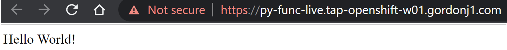
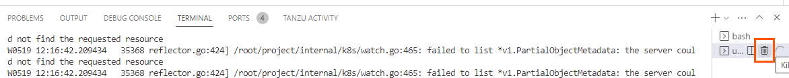

**⚠️　LiveUpdate機能は執筆時点Java
以外では、正式にサポートされていません。⚠️**

LiveUpdateを有効にすることで、コンテナのビルド時間をバイパスができ、サーバー上でしかテストできないコードを高速にIterateすることが可能です。TAP
では、以下の条件の時に、LiveUpdate 可能なイメージの作成を試みます。

-   [Cloud Native Buildpacks](https://buildpacks.io/)
    経由で作成していること
-   ビルドパックがビルド時に BP_LIVE_RELOAD_ENABLED を解釈できること
    -   [Java](https://paketo.io/docs/howto/java/#enable-process-reloading)
    -   [NodeJS](https://paketo.io/docs/howto/nodejs/#enable-process-reloading)
    -   [Python](https://paketo.io/docs/howto/python/#enable-process-reloading)
    -   [Go](https://paketo.io/docs/howto/go/#using-bp_live_reload_enabled)

このハンズオンでは、[Python](https://paketo.io/docs/howto/python/#enable-process-reloading)のガイドに従ったコードでハンズオンを行います。

VSCode ServerをOpen
Folder から以下のディレクトリーを開きます。

-   /home/eduk8s/tap-python-recipies/python-func-liveupdate/

左ペインより"Tanzu Live Update Start" を実行します。

同じくデプロイが完了したら、Hello Worldが表示されることを確認します。

コードをアップデートします。

ブラウザの表示が瞬時で反映されたことを確認します。

最後に Live Update を終了します。

LiveUpdateは非常に強力な機能ですが、期待させた動作をするには、Tiltfileの構成を正しく理解する必要があります。今回のハンズオンの例では、ビルドが伴うrequirements.txtの変更には対応ができない状態になっており、その場合は再デプロイが必要です。要件に応じて利用を検討してください。

ハンズオンは以上です。
