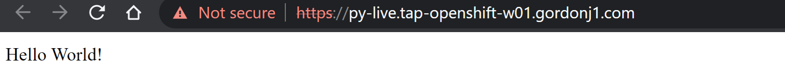
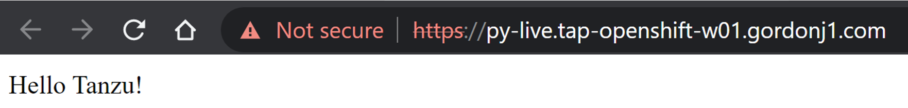
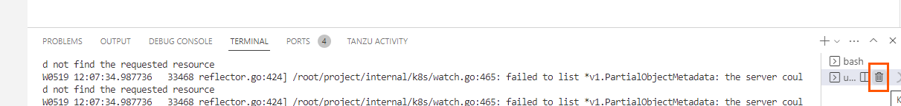

**⚠️　LiveUpdate機能は執筆時点Java
以外では、正式にサポートされていません。⚠️　**

LiveUpdateを有効にすることで、コンテナのビルド時間をバイパスができ、サーバー上でしかテストできないコードを高速にIterateすることが可能です。TAP
では、以下の条件の時に、LiveUpdate 可能なイメージの作成を試みます。

-   [Cloud Native Buildpacks](https://buildpacks.io/)
    経由で作成していること

-   ビルドパックがビルド時に BP_LIVE_RELOAD_ENABLED を解釈できること

    -   [Java](https://paketo.io/docs/howto/java/#enable-process-reloading)

    -   [NodeJS](https://paketo.io/docs/howto/nodejs/#enable-process-reloading)

    -   [Python](https://paketo.io/docs/howto/python/#enable-process-reloading)

    -   [Go](https://paketo.io/docs/howto/go/#using-bp_live_reload_enabled)

このハンズオンでは、[Python](https://paketo.io/docs/howto/python/#enable-process-reloading)のガイドに従ったコードでハンズオンを行います。

#### 従来型コードでLive Update

最初に従来型のコードで実施します。VSCode ServerをOpen Folder
から以下のディレクトリーを開きます。

-   /home/eduk8s/tap-python-recipies/python-rest-liveupdate/

左ペインより"Tanzu Live Update Start" を実行します。

{width="4.436368110236221in"
height="4.232599518810149in"}

デプロイ完了後、Ports を開き、8080 portの"Open in Browser"を開きます。

{width="7.5in"
height="1.332638888888889in"}

そのURL をクリックし、HelloWorldが表示されることを確認します。

{width="7.074864391951006in"
height="0.654154636920385in"}

server.py を開いて、 Hello Tanzu! に変更してみます。

{width="4.188438320209974in"
height="3.2529932195975504in"}

数秒で、コードに反映されることを確認してください。\
{width="7.345692257217848in"
height="0.874983595800525in"}

デモ終了後は、一旦 Live Update を終了します。

{width="7.528630796150481in"
height="0.8952296587926509in"}

コードを参照して以下の点を確認してください。

-   Procfile
    が、[コミュニティガイドに従った書き方](https://paketo.io/docs/howto/python/#setting-a-reloadable-start-command)になっていること

-   Tiltfileが存在しており、どのパスのファイルをモニターするかなどが記載されていること

#### Functions アプリケーションでLiveUpdate

次にFunctionアプリケーションでも実施してみます。VSCode ServerをOpen
Folder から以下のディレクトリーを開きます。

-   /home/eduk8s/tap-python-recipies/python-func-liveupdate/

{width="4.151061898512686in"
height="4.510106080489939in"}

左ペインより"Tanzu Live Update Start" を実行します。

同じくデプロイが完了したら、Hello Worldが表示されることを確認します。

{width="7.5in"
height="1.332638888888889in"}

{width="7.408191163604549in"
height="0.745819116360455in"}

コードをアップデートします。

{width="6.209580052493438in"
height="1.9429538495188101in"}

ブラウザの表示が瞬時で反映されたことを確認します。

{width="7.358192257217848in"
height="0.79165135608049in"}

最後に Live Update を終了します。

{width="7.586064085739283in"
height="0.7573108048993876in"}

LiveUpdateは非常に強力な機能ですが、期待させた動作をするには、Tiltfileの構成を正しく理解する必要があります。\
今回のハンズオンの例では、ビルドが伴うrequirements.txtの変更には対応ができない状態になっており、その場合は再デプロイが必要です。要件に応じて利用を検討してください。

ハンズオンは以上です。
