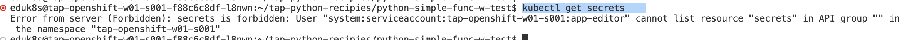

Service Bindings の動作については、Buildpack の仕様に大きく依存します。
しかし、仕組み知ることでサービスを抽象化することができます。


VScode ServerのOpen Folder より以下を開いてください。

-   /home/eduk8s/tap-php-recipies/php-simple-w-custom-bindings/


Editor のターミナルを開いて以下を確認してください。
まず以下のコマンドを実行します。

```
kubectl get secrets
```




ここで、重要なのが、**App Developer がSecret
にはアクセスができない**という点です。Secretにはアクセスできないにも関わらず、どのようにアプリケーションから利用できるかみていきます。

以下のコマンドを実行して postgres がデプロイされていることを確認します。


```
tanzu service class-claim get postgres-claim
```

左ペインより、"Tanzu Apply Workload"
を実行します。デプロイが完了するまでまちます。
```
kubectl get ksvc
```
よりエンドポイントを確認後、ブラウザよりurlへアクセスを行います。\
すると以下のとおり、接続先の Postgres のバージョンが表示されていることを確認します。


Terminal より以下のコマンドを実行します。すると認証情報がコンテナ内部に保管されていることがわかります。

```execute
kubectl exec -it `kubectl get po -l serving.knative.dev/configuration=php-simple-w-custom-bindings -o=jsonpath='{.items[].metadata.name}'` -- ls /bindings/postgres/
```


index.php のコードをみてみます。以下の特徴をみています。

- SERVICE_BINDING_ROOT以下のファイルを検索しにいっていること
- type というファイルかつ、その中身 postgres が含まれているか確認
- 上記が正しい場合、postgres の接続情報を他のファイルから取得


App Developer 視点での Service Bindings
のメリットとして、パスワードなどの認証情報を知らずともアプリケーションのライブラリによって、透過的に渡すことができます。このようにすることでよりセキュアな外部リソース管理が行えます。

Service Bindings 検証は以上です。
