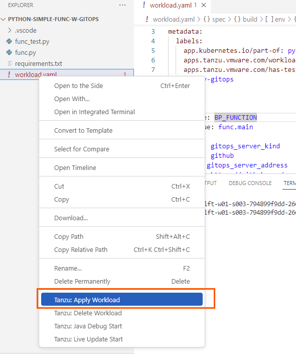

TAPのデプロイを承認などで制御するGitOpsモードのハンズオンです。

**⚠️　Pull Request を作る機能は執筆時点では Github / Gitlab / Azure
Devops のみがサポート対象です。⚠️**

TMCにログインを行い、SupplyChain Basic を開きます。


Commit_stragety を開き、pull_request に変更します。


変更後 Apply Changes を選択します。(**これを行なった段階で他のデプロイがうまく行かなくなります。**)

事前に取得したGithub
のユーザーとパスワードを設定します。(当日講師によって伝えられます。)

```
export GIT_USERNAME=USERNAME
export GIT_PASSWORD=PASSWORD
```

以下のコマンドを実行します。

```execute
cat <<EOF | kubectl apply -n -f-
apiVersion: v1
kind: Secret
metadata:
  name: git-ssh
  annotations:
    tekton.dev/git-0: https://github.com
type: kubernetes.io/basic-auth
stringData:
  username: ${GIT_USERNAME}
  password: ${GIT_PASSWORD}
EOF
```


以下のコマンドでSAにgitのキーを登録します。

```
kubectl patch -n $YOUR_NAMESPACE serviceaccount default -p "{\"secrets\":[{\"name\":\"git-ssh\"}]}"
```


Github上に任意のレポジトリを作成します。\
(readme file 作成にチェックを入れて作成します。)


VScode Server から Open Folder
を実行し、以下のディレクトリーを開きます。

-   /home/eduk8s/tap-python-recipies/python-simple-func-w-gitops/


Workload.yaml を開きます。Gitops_respository_owner と
gitops_repository_name を正しいものにアップデートします。


**⚠️　Workload個別で設定する他にクラスタ全体でデフォルト値を設定する方法があります。その場合このパラメータは不要です。⚠️**

左ペインより、Tanzu Apply Workloadを実行します。



しばらくして、Supply Chains -\> py-gitops -\> Config Writer より Pull
Requestが成されていることを確認します。


APPROVE A REQUEST を選択することで、Github の pull request
画面に遷移します。
Github 上から Merge pull request をします。


マージとともに環境にデプロイがすすんだことを確認します。


GitOpsのハンズオンは以上です。
