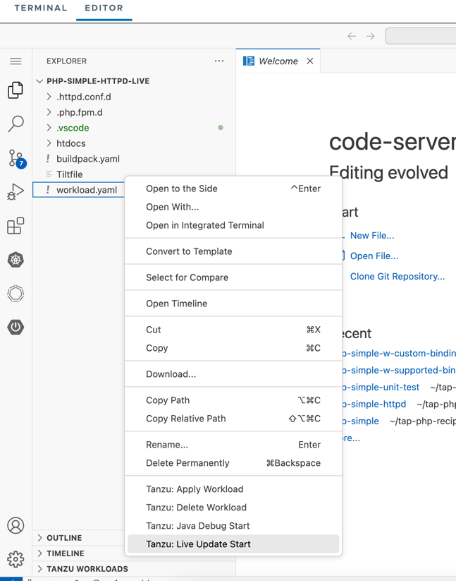

**⚠️　LiveUpdate機能は執筆時点Java
以外では、正式にサポートされていません。⚠️**

LiveUpdateを有効にすることで、コンテナのビルド時間をバイパスができ、サーバー上でしかテストできないコードを高速にIterateすることが可能です。TAP
では、以下の条件の時に、LiveUpdate 可能なイメージの作成を試みます。

-   [Cloud Native Buildpacks](https://buildpacks.io/)
    経由で作成していること
-   ビルドパックがビルド時に BP_LIVE_RELOAD_ENABLED を解釈できること

このハンズオンでは、カスタマイズを加えながら、PHPコードでハンズオンを行います。

VSCode ServerをOpen
Folder から以下のディレクトリーを開きます。

-   /home/eduk8s/tap-php-recipies/php-simple-httpd-live


左ペインより"Tanzu Live Update Start" を実行します。



同じくデプロイが完了したら、Hello Worldが表示されることを確認します。


htdocs/index.php コードをアップデートします。 ブラウザの表示が瞬時で反映されたことを確認します。

さらに、.httpd.conf.d/header-server.conf コードをアップデートします。
ヘッダーが更新されたことを確認します。起動が完了したら以下のコマンドでURLを確認してブラウザでログインします。

```
kubectl get ksvc
```

表示されたURLに対して以下のコマンドを実行します。

```
curl -i $URL
```


LiveUpdateは非常に強力な機能ですが、期待させた動作をするには、Tiltfileの構成を正しく理解する必要があります。要件に応じて利用を検討してください。

ハンズオンは以上です。
