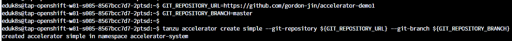

ここからは TAP のカタログ機能である Application Accelerator
について紹介します。

この機能を使うことで、企業はアプリケーションの標準テンプレート用意し、開発者はビジネスロジックのみに専念できます。詳細は以下のブログも参考ください。

[Tanzu Application Platformでアプリの雛形をつくろう：Application
Accelerator](https://blogs.vmware.com/vmware-japan/2022/02/lets-build-catalogs-tanzu-application-platform-appaccelerator.html)

まず、既存の app accelerator を確認します。

```execute
tanzu accelerator list
```


TAP GUI からも確認できます。


手動で新しいApplication Accelerators
テンプレートを登録します。Github 上の Repositoryを使って App Accelerator に登録します。

```execute
GIT_REPOSITORY_URL=https://github.com/mhoshi-vm/tap-python-recipies.git
GIT_REPOSITORY_BRANCH=main
tanzu accelerator create tap-python-recipies --git-repository ${GIT_REPOSITORY_URL} --git-branch ${GIT_REPOSITORY_BRANCH}
```




<https://github.com/mhoshi-vm/tap-python-recipies/accelerator.yaml>

上記のファイルがApplication Accelerator を登録するための YAML
ファイルです。以下のような項目から構成されています。

-   displayName : TAP GUI -\> Generate Acceleratorsで表示される名前
-   description： より詳細な説明
-   iconUrl: アイコン画像を指す URL
-   options: (inputType: select) ドロップダウンリストを定義
-   engine:
    ドロップダウンリストで選択された内容に基づいて定義されたアクションを実行(今回の場合は、githubリポジトリのサブフォルダを含める)

tanzu cli とTAP GUI
からどのように表示されているかを確認します。再度、app accelerator
を確認します。

```execute
tanzu accelerator list
```

tap-python-recipies が登録されているのを確認できます。


TAP GUI からも新規で登録した tap-python-recipiesを確認します。


CHOOSE ボタンをクリックし、Generate Accelerators 画面でChoose Python
Framework \* ドロップダウンリストを展開します。


”GitOps モードのデプロイ" 選択します。また、Branch-name \* と
Owner-name \* を下記のように変更します。


NEXT ボタン -\> GENERATE ACCELERATOR ボタンを選択します。
EXPLORE ZIP FILE を選択し、生成されたテンプレートの中身を確認します。
gitops_repository_owner と gitops_branch
が反映されているのを確認できます。


このように、標準テンプレートを用意し、Application
Accelerator に登録することで、基盤に関わるパラメーターを意識することなく、開発に着手できます。

Application Acceleratorのデモは以上です。
