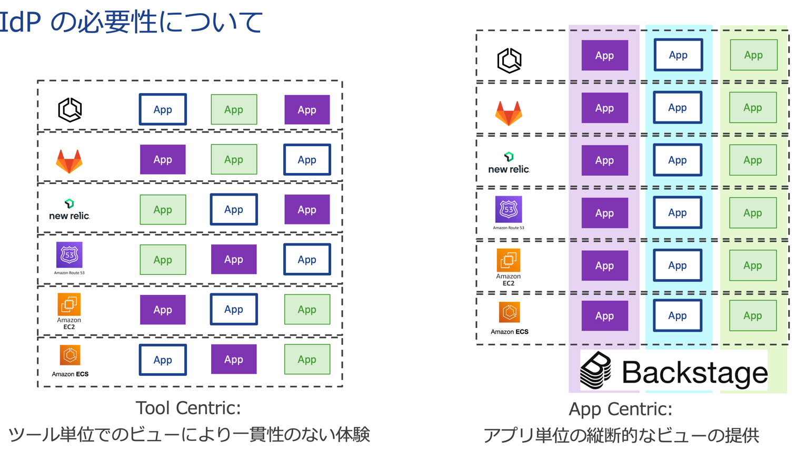
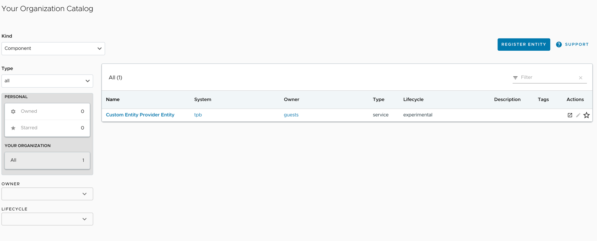

TAP GUI にてここまでデプロイしてきたものをみてみます。
TAP GUI のバックエンドになっているBackstageが得意とするものが、ツールでのビューではなく、アプリを中心としたビューを提供することです。

ここでは簡単ながら Backstage を体感します。TAP GUI にログインを行い、以下に進みます。

この中の "Register Entity"　を選択します。
Select URL の中に以下を入力します。

