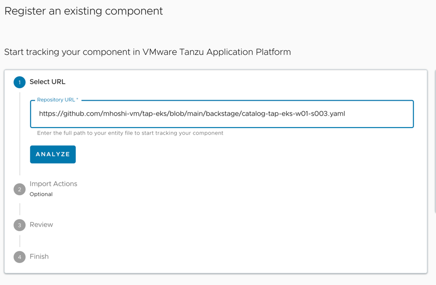

TAP GUI にてここまでデプロイしてきたものをみてみます。
TAP GUI のバックエンドになっているBackstageが得意とするものが、ツールでのビューではなく、アプリを中心としたビューを提供することです。


ここでは簡単ながら Backstage を体感します。TAP GUI にログインを行い、以下に進みます。


この中の "Register Entity"　を選択します。
Select URL の中に以下を入力します。

```
https://github.com/mhoshi-vm/tap-eks/blob/main/backstage/catalog-tap-${YOUR_NAMESPACE}.yaml
```


登録ののち、TAPのトップ画面に該当のアプリケーションが存在することを確認します。


自身の該当のアプリケーションを展開して、Runtime Resource タブを選択します。
すると、自身のデプロイしたアプリケーションに関係したリソースが一覧が取得されます。


ここから pod のログをみることができます。


Backstage は複数のリソースをネームスペースとはさらに異なり、縦断的なビューを提供することが可能です。
Kubernetes の場合、これはラベルによって制御されています。

TAP GUIの確認は以上です。