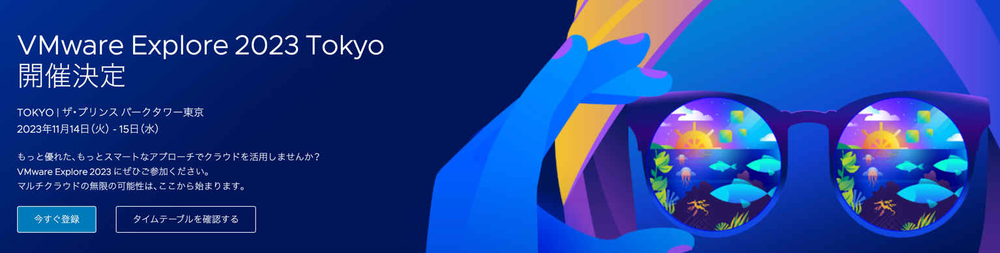

VMware Explore 2023 Tokyo は、4年ぶりとなる 2日間会場での開催となります。
今回の講師は、TAPではなく、生成AIのトピックで登壇します。  
https://www.vmware.com/explore/jp/content/sess/MC31104.html

TAPのエキスパートによるセッションも開催されます。
https://www.vmware.com/explore/jp/content/sess/MC31103.html  
その他、ハイブリッドクラウド/マルチクラウド、クラウド管理・運用、Edge Compute、コンテナ/Kubernetes、ネットワークセキュリティ、DEX（従業員のデジタル体験）、統合エンドポイント管理/セキュリティ、生成AI/AI/機械学習などをキーワードに、両日多数のセッションをご用意して参ります。
10月20日（金）までにご登録いただきますと、早期登録特典として
Explore ポイントラリーに参加できるポイントを進呈いたします。  
人気セッションは早々に満席となる場合がございますのでお早目にご登録ください。
下記よりご登録が可能です。  
https://www.vmware.com/explore/jp.html?src=EPM1079