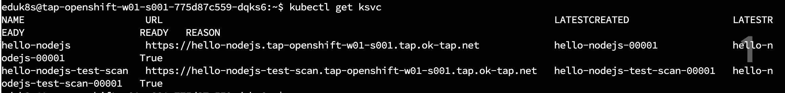

サンプルアプリケーションをデプロイします。

TERMINAL で作業します。


自身のネームスペースの値を変数に設定してください。

```execute
export YOUR_NAMESPACE=`kubectl config view --minify -o jsonpath='{..namespace}'`
```

以下をTerminalより実行してください。

```execute
tanzu apps workload apply hello-nodejs \
  --app hello-nodejs \
  --git-repo https://github.com/making/hello-nodejs \
  --git-branch master \
  --type web \
  -y
```

待ち時間が発生するので続いて、テスト・スキャンありのワークロードを作成します。`apps.tanzu.vmware.com/has-tests=true` ラベルにより、テストおよびスキャンが行われます。

```execute
tanzu apps workload apply hello-nodejs-test-scan \
  --app hello-nodejs \
  --git-repo https://github.com/making/hello-nodejs \
  --git-branch master \
  --type web \
  --label apps.tanzu.vmware.com/has-tests=true \
  -y
```

以下のコマンドで、デプロイが完了したことを確認します。
(完了まで、5分ほどかかりますのでその間に何度か実行してください。現在の進捗は `kubectl get po`で確認ができます。)


```execute
tanzu apps workload list
```


ステータスが両者共に`Ready`になったら以下のコマンドで、Workload の URLを確認します。

```execute
kubectl get ksvc
```



curl コマンドで上記のURL にアクセスしてみます。

```execute
curl -k https://hello-nodejs.${YOUR_NAMESPACE}.tap.ok-tap.net
curl -k https://hello-nodejs-test-scan.${YOUR_NAMESPACE}.tap.ok-tap.net
```


サンプルアプリケーションのデプロイは以上ですが、以下のコマンドなどを行いながら、ワークロードを確認してください。

-   tanzu apps workload get \<対象のワークロード\>
-   TAP GUI での比較


