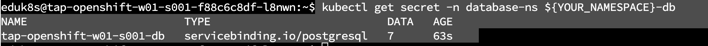

TERMINAL で作業します。


自身のネームスペースの値を変数に設定してください。

```execute
export YOUR_NAMESPACE=`kubectl config view --minify -o jsonpath='{..namespace}'`
```

本来は、外部データベース作成する必要がありますが、ここでは**外部データベースが既に存在しているという仮定**でその認証情報を利用できるようにしていく方法を紹介します。

以下のような Secret
を作成します。重要な点として、値はダミーのものをいれていますが、実環境では対象のサービスの情報をいれます。

```execute
cat <<EOF | kubectl apply -f-
apiVersion: v1
kind: Secret
metadata:
  name: ${YOUR_NAMESPACE}-db
  namespace: database-ns
  labels:
    postgres: "true"
type: servicebinding.io/postgresql
stringData:
  type: postgresql
  database: aaaaa
  host: bbbbb
  password: cccc
  port: dddd
  provider: postgresql
  username: eeee
EOF
```

このSecret 作成後に以下のコマンドで secret を確認します。

```execute
kubectl get secret -n database-ns ${YOUR_NAMESPACE}-db
```



次に "-n database-ns" を" -n \$YOUR_NAMESPACE" に変えて実行します。

```execute
kubectl get secret -n $YOUR_NAMESPACE ${YOUR_NAMESPACE}-db
```


これは、Postgresの認証情報が特定のNamespaceでしか利用可能でない状態を表しており、このままでは
Developer
ネームスペースでは利用ができないです。以下のコマンドを実行します。

```execute
tanzu service claim create ${YOUR_NAMESPACE}-claim  \
  --resource-name ${YOUR_NAMESPACE}-db \
  --resource-kind Secret \
  --resource-api-version v1 \
  --resource-namespace database-ns　
```


実行結果は下記となります。


実行後再度同じコマンドを実行すると、新しくSecretがDeveloperネームペースにコピーされたことを確認します。

```execute
kubectl get secret -n $YOUR_NAMESPACE ${YOUR_NAMESPACE}-db
```


tanzu services resource-claims コマンドからも resource claim
を確認できます。

```execute
tanzu services resource-claims get ${YOUR_NAMESPACE}-claim  
```


ここで、同じ claim を別のネームスペース(default)で作ろうと試みてみます。

```execute
tanzu service claim create ${YOUR_NAMESPACE}-claim  \
  --resource-name ${YOUR_NAMESPACE}-db \
  --resource-kind Secret \
  --resource-api-version v1 \
  --resource-namespace database-ns \
  -n default
```


この claim の状態を確認します。
```execute
tanzu services resource-claims get ${YOUR_NAMESPACE}-claim -n default
```


確認すると" resource has already been claimed by another ResourceClaim"
というメッセージで失敗していることがわかります。ここまでの挙動をまとめるとこのResourceClaim
には以下のような特徴があります。

-   Platform Operator
    が外部データベースの認証情報をプール化して用意をする

-   App Operator が Claim をすることで自身のNamespaceに secret
    がコピーされる

-   一度 Claim が完了すると、他の Namespace からは Claim ができない

-   よって、**外部リソースに対して予約という概念が生まれ、リソースの競合などを防ぐことができます。**

Service Bindings/Service Toolkit の App Developer からみた利点はFor App
Operator の際に紹介します。
一度不要なResourceClaim は削除します。

```execute
tanzu services resource-claims delete ${YOUR_NAMESPACE}-claim -n default -y
```

さて、先程作成した resource claim を使って Workload をデプロイします。
以下を実行し、クレームのアクセス権があることを確認します。

```execute
tanzu services claims list
```


この状態で、以下のコマンドを実行します。赤字にSecretではなくClaimを指定します。

```execute
tanzu apps workload apply hello-vehicle \
  --app hello-vehicle \
  --git-repo https://github.com/making/vehicle-api \
  --git-branch main \
  --type web \
  --build-env BP_JVM_VERSION=17 \
  --service-ref vehicle=services.apps.tanzu.vmware.com/v1alpha1:ResourceClaim:${YOUR_NAMESPACE}-claim \
  --annotation autoscaling.knative.dev/minScale=1 \
  -y
```


しばらくするとインスタンスがエラーで起動しますが、これは想定通りです。kubectl
get podsを実行します。


ログを確認すると、設定したダミーの認証情報を引き継げていることがわかります。


ハンズオンとしては、Services Toolkit と Services Bindings
についてはまだ基本的なところしか取り上げていないので、以下のブログも併せてご参照ください。

-   [Tanzu Application Platform で開発者が使いやすいサービスを --
    Services Toolkit
    の紹介](https://blogs.vmware.com/vmware-japan/2022/07/services-tookit-for-easy-service.html)

-   [Tanzu Application Platform
    でサービス連携の「面倒なこと」を「約束」で解決：Service
    Bindings](https://blogs.vmware.com/vmware-japan/2022/04/tanzu-application-platform-simplify-service-bindings-with-contracts.html)

以上 Service Bindings の稼働検証が完了です。
