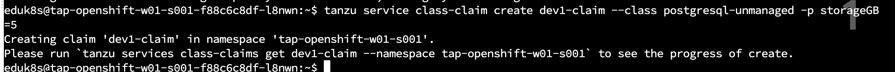
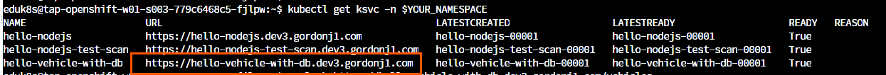
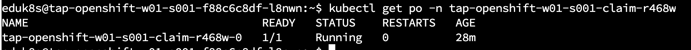

先程までは、静的な Sevice
Toolkitサービスプロビジョニングについて紹介しました。
本番環境など、慎重な設計をした外部リソースにはこの手段が望ましいと思いますが、検証やステージングにおいては、Platform
Operator チームがボトルネックになる考慮点がでてきます。

そこで、動的サービスプロビジョニングについて紹介します。TAP1.5
からはデータベースなどバックエンドサービスも含め開発チーム側からバックエンドサービスをデプロイし、Workloadに容易にバックエンドサービスにバインドできる機能を提供しています。

TERMINAL で作業します。


自身のネームスペースの値を再度設定してください。

```execute
export YOUR_NAMESPACE=`kubectl config view --minify -o jsonpath='{..namespace}'`
```


今回はプリインストールされたBitnami Services　を利用します。以下のコマンドで利用できるサービスを確認します。

```execute
tanzu service class list
```

今回は postgresql
を利用するため、下記のコマンドを実行し利用できるサービスのパラメータを確認します。


```execute
tanzu service class get postgresql-unmanaged
```


上記の storageGBはDB容量の単位を指しており、今回は 5GB容量の
DBを使いたいので、下記のコマンドを実行して\
class claim を作成します。

```execute
tanzu service class-claim create ${YOUR_NAMESPACE}-claim --class postgresql-unmanaged -p storageGB=5
```



また、下記のコマンドを実行して、class claim の作成状況を確認します。

```execute
tanzu services class-claims get ${YOUR_NAMESPACE}-claim  
```


\
storageGB: 5\
Ready: True

の情報を確認できます。

この状態で、Workload
を再度デプロイします。**ResourceClaimではなくClassClaimを指定します**。

```execute
tanzu apps workload apply hello-vehicle-with-db-dynamic \
  --app hello-vehicle-with-db \
  --git-repo https://github.com/making/vehicle-api \
  --git-branch main \
  --type web \
  --build-env BP_JVM_VERSION=17 \
  --env "JAVA_TOOL_OPTIONS=-Dmanagement.health.probes.enabled='false'" \
  --service-ref vehicle=services.apps.tanzu.vmware.com/v1alpha1:ClassClaim:${YOUR_NAMESPACE}-claim \
  --annotation autoscaling.knative.dev/minScale=1 \
  -y
```


下記のコマンドを実行し、hello-vehicle-with-db
Workloadがデプロイされているのを確認します。

```execute
tanzu apps wld list
```


下記のコマンドでURL を確認し、サービスにアクセスしてみます。

```execute
kubectl get ksvc
```



```execute
curl -k https://hello-vehicle-with-db-dynamic.${YOUR_NAMESPACE}.tap.ok-tap.net/vehicles  | jq .
```


サービスとして動いている
postgresql は下記のコマンドで確認できます。

まず、Namespace を確認し、該当 namespace をPod を確認します。

```execute
kubectl get ns  | grep ${YOUR_NAMESPACE}-claim
```


該当Namespaceのpodを確認すると、postgresql が稼働しています。



postgresql のデータベースに書き込みがされていることを確認します。

```execute
DB_NAME=$(kubectl get classclaim ${YOUR_NAMESPACE}-claim -ojsonpath='{.status.provisionedResourceRef.name}')
kubectl exec -ti -n ${DB_NAME} ${DB_NAME}-0 -- bash -c 'PGPASSWORD=${POSTGRES_PASSWORD} /opt/bitnami/postgresql/bin/psql -U postgres ${POSTGRES_DB} -c "SELECT * FROM vehicle"'
```

以下のように、データベースの中身が表示され、さきほどの `curl` との出力が一致することが確認できます。

```
id |  name   
----+---------
 1 | Avalon
 2 | Corolla
 3 | Crown
 4 | Levin
 5 | Yaris
 6 | Vios
 7 | Glanza
 8 | Aygo
(8 rows)
```

動的サービスはカスタマイズすることで様々なバックエンドサービスを self
serviceで利用可能です。カスタマイズした動的プロビジョニングサービスとして利用したい場合は、個別にサービスを登録する必要があります。関連手順は下記です。\
\
<https://docs.vmware.com/en/VMware-Tanzu-Application-Platform/1.5/tap/services-toolkit-tutorials-setup-dynamic-provisioning.html>

Service Toolkit の動的プロビジョニングの手順の完了です。
